# Camera Entry/Exit Tracker

A computer vision system that tracks people entering and exiting through a designated door area using YOLO object detection and ReID (Re-Identification) techniques.

## 🏗️ Project Structure

```
camera_entry_exit_tracker/
├── config/
│   ├── __init__.py
│   └── settings.py          # Configuration and constants
├── detector/
│   ├── __init__.py
│   ├── person_detector.py   # YOLO-based person detection
│   └── reid_tracker.py      # ReID tracking and matching
├── utils/
│   ├── __init__.py
│   └── visualization.py     # Debug visualization functions
├── door_box_gui_selector.py # GUI tool for door area selection
├── main.py                  # Main application entry point
├── requirements.txt         # Python dependencies
└── README.md               # This file
```

## 🚀 Features

- **Person Detection**: Uses YOLOv8 for accurate person detection
- **Door Zone Tracking**: Monitors a predefined door area for person overlap
- **ReID Matching**: Uses FusionReID model for person re-identification
- **Entry/Exit Classification**: Determines if a person is entering or exiting
- **Event Logging**: Saves timestamps and images of detected events
- **Debug Visualization**: Optional debug mode with visual overlays

## 📋 Requirements

- Python 3.8+
- CUDA-capable GPU (recommended)
- See `requirements.txt` for full dependency list

## 🛠️ Installation

1. Clone the repository:

```bash
git clone <repository-url>
cd camera_entry_exit_tracker
```

2. Install dependencies:

```bash
pip install -r requirements.txt
```

3. Download YOLOv8 model (will be downloaded automatically on first run)

## ⚡ Quick Start

1. **Select Door Area**:

   ```bash
   python door_box_gui_selector.py
   ```
2. **Update Configuration**:

   - Copy the generated coordinates to `config/settings.py`
   - Update `VIDEO_PATH` to your video file
3. **Run the System**:

   ```bash
   python main.py
   ```

## 🎯 Usage

### Workflow Diagram

```mermaid
graph TD
    A[📹 Input Video] --> B[🚪 Door Box Selector]
    B --> C[🎯 Select Door Area]
    C --> D[📝 Update Config]
    D --> E[🔍 Person Detection]
    E --> F[🚪 Door Overlap Check]
    F --> G[🆔 ReID Tracking]
    G --> H[📊 Entry/Exit Classification]
    H --> I[💾 Save Results]
  
    B --> J[GUI Tool: door_box_gui_selector.py]
    J --> C
    C --> K[Manual: Edit config/settings.py]
    K --> D
    D --> L[Main System: main.py]
    L --> E
```



### Step-by-Step Process

#### 1. Door Area Selection (Required First Step)

**Option A: GUI Tool (Recommended)**

```bash
python door_box_gui_selector.py
```

- Opens video frame for interactive door area selection
- Click 4 corners of the door area
- Copy the generated coordinates to `config/settings.py`

**Option B: Manual Configuration**
Edit `config/settings.py` and update:

```python
DOOR_BOX = (x1, y1, x2, y2)  # Your door coordinates
```

#### 2. Configure Other Settings

Edit `config/settings.py` to adjust:

- Video path (`VIDEO_PATH`)
- Detection thresholds (`CONF_THRESHOLD`, `OVERLAP_THRESHOLD`)
- Debug mode (`DEBUG_MODE`)

#### 3. Run the Tracker

```bash
python main.py
```

## ⚙️ Configuration

Key settings in `config/settings.py`:

- `VIDEO_PATH`: Path to input video file
- `DOOR_BOX`: Door area coordinates (x1, y1, x2, y2)
- `CONF_THRESHOLD`: YOLO confidence threshold
- `OVERLAP_THRESHOLD`: IoU threshold for door overlap
- `DEBUG_MODE`: Enable debug visualization
- `FRAME_LOOKAHEAD`: Number of frames to buffer for tracking

## 📊 Output

The system generates:

- `entry_exit_log.json`: Event log with timestamps and status
- `logs/entry/`: Images of people entering
- `logs/exit/`: Images of people exiting

## 🔧 Architecture

### Components

1. **PersonDetector**: Handles YOLO-based person detection
2. **ReIDTracker**: Manages person re-identification using FusionReID
3. **Visualization**: Provides debug visualization utilities
4. **Configuration**: Centralized settings management

### Processing Pipeline

1. **Door Area Selection**: Use GUI tool or manual configuration to define door zone
2. **Frame Capture**: Read video frames from input video
3. **Person Detection**: Detect persons using YOLOv8
4. **Door Overlap Check**: Check if detected persons overlap with door area
5. **ReID Tracking**: Track person through frame buffer using FusionReID
6. **Entry/Exit Classification**: Determine movement direction (entry/exit)
7. **Event Logging**: Save event data, timestamps, and person images

## 🤝 Contributing

1. Fork the repository
2. Create a feature branch
3. Make your changes
4. Add tests if applicable
5. Submit a pull request

## 📝 License

This project is licensed under the MIT License - see the LICENSE file for details.

## 🙏 Acknowledgments

- YOLOv8 by Ultralytics
- FusionReID model architecture
- OpenCV for computer vision utilities
